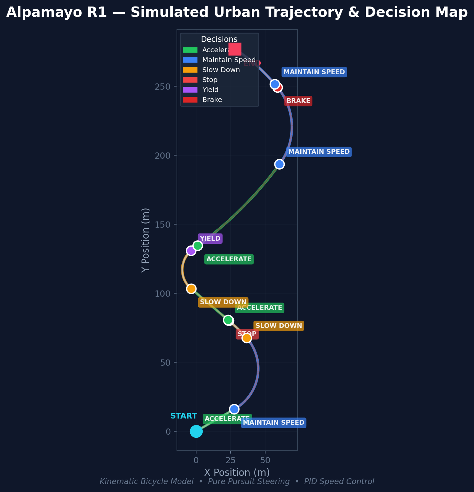
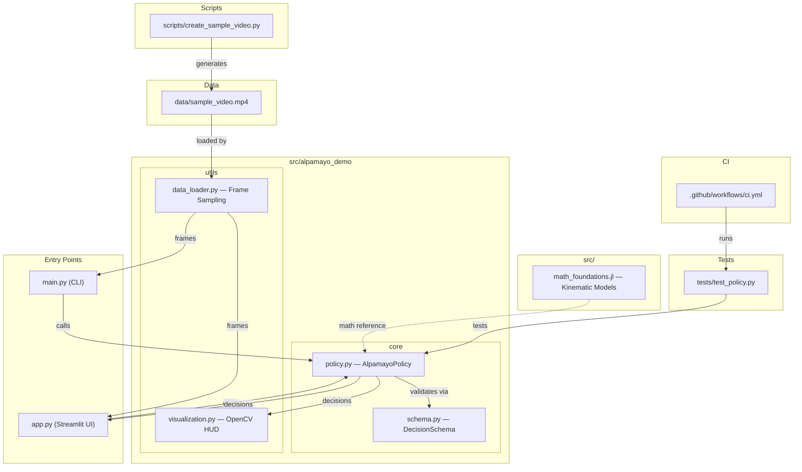

# Alpamayo R1 Autonomous Driving Demo

A minimal demo showcasing Alpamayo R1's video-language-action reasoning capabilities using Waymo Open Dataset camera data.


### Simulated Trajectory & Decision Map

<p align="center">
  
</p>

> **↑ Generated with** `python scripts/generate_trajectory_visual.py` — uses the kinematic bicycle model to simulate an urban route with real-time driving decisions.

## Overview

This demo demonstrates high-level autonomous driving decision making through:
- **Perception**: Scene analysis from camera frames
- **Reasoning**: Language-based decision making
- **Action**: Discrete driving actions
- **Explanation**: Human-readable reasoning

## Features

- Modular Python implementation
- Mock Alpamayo R1 interface (easily swappable with real model)
- **New!** Interactive Streamlit Web Interface (`app.py`) for clear reasoning and UI playback.
- OpenCV-based CLI visualization with frame-by-frame playback
- JSON-structured decision outputs
- Urban driving scenarios (intersections, pedestrians, traffic)

## Installation

1. Clone or download this repository
2. Install dependencies:
   ```bash
   pip install opencv-python numpy
   ```

## Usage

### Local Setup

1. Clone the repository.
2. Install dependencies:
   ```bash
   pip install -r requirements.txt
   ```
3. Set up PYTHONPATH:
   ```bash
   # Windows
   $env:PYTHONPATH = "src"
   # Linux/macOS
   export PYTHONPATH=$PYTHONPATH:$(pwd)/src
   ```

### Quick Start (Streamlit UI)

The easiest way to experience the reasoning loop is our new interactive web app.

1. Generate a quick synthetic sample video to test with immediately:
   ```bash
   python scripts/create_sample_video.py
   ```
2. Run the Streamlit interface:
   ```bash
   streamlit run app.py
   ```

### Command Line Interface

If you prefer the classic OpenCV heads-up display:

```bash
python main.py --video_path data/sample_video.mp4 --fps 1
```

### Docker Support

Build and run using Docker:

```bash
docker build -t alpamayo-demo .
docker run -it alpamayo-demo
```

## Project Structure & Workflow



## Architecture

The project follows a modular design:

- **`AlpamayoPolicy`**: The core decision-making interface.
- **`DecisionSchema`**: Strict validation for model outputs.
- **`DataLoader`**: Optimized frame sampling from high-frequency Waymo data.
- **`Visualization`**: Real-time decision delivery HUD.

### Decision Format

Each timestep outputs JSON with:
```json
{
  "frame_id": 0,
  "scene_type": "intersection",
  "agents": [{"type": "pedestrian", "position": "crossing"}],
  "traffic_light": "red",
  "hazards": ["pedestrian crossing"],
  "decision": "stop",
  "confidence": 0.89,
  "reason": "Pedestrian detected at crosswalk"
}
```

### Actions

- `accelerate`: Increase speed
- `maintain_speed`: Keep current speed
- `slow_down`: Gradually reduce speed
- `brake`: Hard stop
- `stop`: Come to complete stop
- `yield`: Give way to others

## Extending

### Real Alpamayo Integration

Replace the mock in `alpamayo_policy.py` with actual model calls:

```python
def decide(self, frame, prompt):
    # Process frame with vision model
    # Send to Alpamayo with prompt
    # Return structured JSON
    pass
```

### Additional Data Sources

Modify `data_loader.py` to load from:
- Waymo TFRecords directly
- Other autonomous driving datasets
- Live camera feeds

### Enhanced UI

We have provided a base Streamlit UI in `app.py`. Feel free to extend it further with:
- Timeline scrubbing
- Full decision history exports
- Interactive playback controls

## Dependencies

- opencv-python: Video processing and visualization
- numpy: Array operations

## License

[Add appropriate license]

## Contributing

[Add contribution guidelines]
